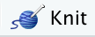
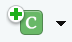
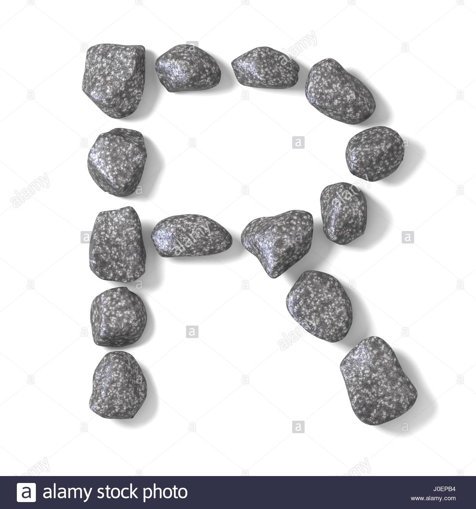

# Introduccion

Este es un documento [R Markdown](http://rmarkdown.rstudio.com). Permite trabajar con texto y ejecutar codigo de manera conjunta para generar un documento completo de su analisis. Para compilar el documento haga click en *Knit* ({width="39" height="15"}).

Los bloques de codigo se identifican por `{r}`, con opciones (opcionales) en formato YAML que empiezan con `#|` al inicio de cada bloque o dentro de `{r}`. Para ejecutar un bloque de codigo se puede hacer click en el boton de *Run* ({width="20"}) dentro del bloque, o colocando el cursor dentro del bloque y ejecutando *Cmd+Shift+Enter* (Mac) o *Ctrl+Shift+Enter* (Windows).

Se puede agregar una nueva seccion haciendo click en *Insert Chunk* ({width="25" height="15"}), o ejecutando *Ctrl+Alt+I* (Windows) o *Cmd+Option+I* (Mac).

El primer bloque siempre se usa para cargar paquetes y datos a usar durante la sesion, así como parametros opcionales globales. Los bloques pueden llevar una etiqueta (label) pero no es necesario; si se usan las etiquetas todas deben ser diferentes, no pueden haber dos bloques de codigo con la misma etiqueta.

```{r setup, include=TRUE, message=FALSE, warning=FALSE}
library(MOTE)
library(papaja)
library(kableExtra)
library(gt)
library(flextable)
library(plotly)
library(dygraphs)
library(rio)
library(tidyverse)

formato.salida = case_when(
  knitr::is_html_output() ~ 'html',
  knitr::is_latex_output() ~ 'latex',
  T  ~ 'simple',
)

options(
  knitr.table.format = formato.salida
  # OutDec = ','
  , digits = 3
)

set_flextable_defaults(
  # decimal.mark = ',',
  # big.mark = '.',
  digits = 3
)

knitr::opts_chunk$set(
  echo = TRUE,
  message = FALSE,
  warning = FALSE,
  error = FALSE,
  # fig.path = "figs/",
  fig.retina = 3,
  fig.width = 8,
  fig.asp = 0.618,
  fig.align = "center",
  out.width = "90%"
)

```

# Tipos de resultados

## Consola

Podemos crear diferentes objetos dentro del bloque como si fuera la consola de **R**. Creemos un objeto que contenga los numeros del 1 al 15.

```{r numeros}
numeros <- seq_len(15)
numeros
```

Podemos desplegar tablas. La apariencia va a cambiar dependiendo el formato de salida y va a estar sujeta (en principio) a la opcion `df_print` en el encabezado YAML.

```{r tabla}
mtcars %>% 
  head()
```

Tablas tambien se pueden usar diferentes paquetes para representarlas mejor en el documento final. Dentro de las opciones tipicas estan los paquetes **flextable**, **kableExtra**, y **gt**, con las funciones `flextable`, `kable`, y `gt`, respectivamente. **flextable** es el mas versatil y permite crear tablas para todo tipo de documento, **kableExtra** sirve mas para *html* y *pdf*, y **gt** sirve para *html*.

```{r}
mtcars %>% 
  head() %>% 
  flextable()
```

```{r}
mtcars %>% 
  head() %>% 
  kable()
```

```{r}
mtcars %>% 
  head() %>% 
  gt()
```

## Graficos

Graficos de **ggplot2** o cualquier otro grafico estatico son resultados que se pueden desplegar dentro del coumento. Opciones para el control sobre las figuras van a empezar con `fig.` en el encabezado del codigo (como se observa en el siguiente ejemplo donde se ajusta el ancho a 6 pulgadas)

```{r fig-disp}
#| fig.width: 6
#| fig.cap: "Grafico de dispersion creado con **ggplot2**."

q = ggplot(mtcars, aes(wt,mpg,col=factor(cyl))) + 
  geom_point(size=2,shape=1) + 
  theme_bw() + 
  labs(x='Peso',y='Millaje',col='Cilindros')
q
```

## Widgets HTML

Si el analisis en **R** involucra componentes interactivos, estos tambien son compatibles con los resultados en el cuaderno o archivo *html*. La opcion `eval=knitr::is_html_output()` se incluye para que el codigo sea evaluado unicamente cuando el formato de salida es *html*, ya que estos no pueden desplegarse en *pdf* o *word*.

El siguiente codigo genera un grafico interactivo de una serie temporal.

```{r fig-dygraph, fig.cap="Grafico interactivo creado con **dygraph**.", eval=knitr::is_html_output()}

dygraph(nhtemp, main = "Temperaturas de New Haven") %>% 
  dyRangeSelector(dateWindow = c("1920-01-01", "1960-01-01"))
```

Esta es la version interactiva del grafico de ggplot anteriormente generado.

```{r plotly, eval=knitr::is_html_output()}
#| label: fig-plotly
#| fig-cap: "Grafico interactivo creado con **plotly**."

ggplotly(q)
```

# Formulas

Expresiones matematicas y formulas se pueden desplegar en linea, dentro del cuerpo del texto ($A = \pi*r^{2}$) o por separado

$$E = mc^{2}$$ Para escribir estas expresiones se usa lenguaje `LaTeX`.

# Importando datos

Los documentos *R Markdown* usan una dirección relativa a la ubicación del archivo.

Otro punto importante es que se pueden llamar funciones de paquetes sin necesidad de cargarlos usando la sintaxis `paquete::funcion()`. Por ejemplo en el bloque que sigue se usa `rio::import()`, siendo `rio` el paquete e `import()` la función a usar. **Esto puede evitar conflictos cuando se tienen funciones con el mismo nombre en diferentes paquetes**.

```{r}
dat <- rio::import("data/PORPERM.csv")
```

# Desplegar/formatear valores

Siempre que un valor exista dentro de un objeto guardado, este se puede acceder para ser desplegado en el cuerpo del documento. Por ejemplo: La porosidad media es de `r mean(dat$Porosity)`%, que se escribe de la siguiente manera: `` `r knitr::inline_expr('mean(dat$Porosity)')` ``.

Para dar formato a valores se pueden usar funciones como `apa()` del paquete **MOTE**, `printnum` o `printp` (valores-*p*) del paquete **papaja**. Volviendo a desplegar la porosidad media se tiene `r apa(mean(dat$Porosity), 1)`%, usando `apa()` con 1 decimales.

# Importando figuras

La mejor manera es usando el paquete **knitr**. Aqui se ajusta no el ancho de la figura directamente sino que se le dice que se ajuste a un 50% del ancho disponible. Existen otras opciones que empiezan con `out.`.

```{r}
#| label: fig-rocks
#| fig-cap: "R-Rocks"
#| out-width: '70%'


```

# Salvando y compartiendo

Los documentos *R Markdown* tienen como extension `.Rmd`. Cuando se compila se crea un archivo adjunto con extension `.html`. Este archivo contiene una copia renderizada del cuaderno, que puede ser visualizada en cualquier navegador.

## Otros formatos

El documento *R Markdown* se puede compilar a diferentes formatos de salida, dependiendo de las opciones especificadas en `output` en el encabezado YAML.
